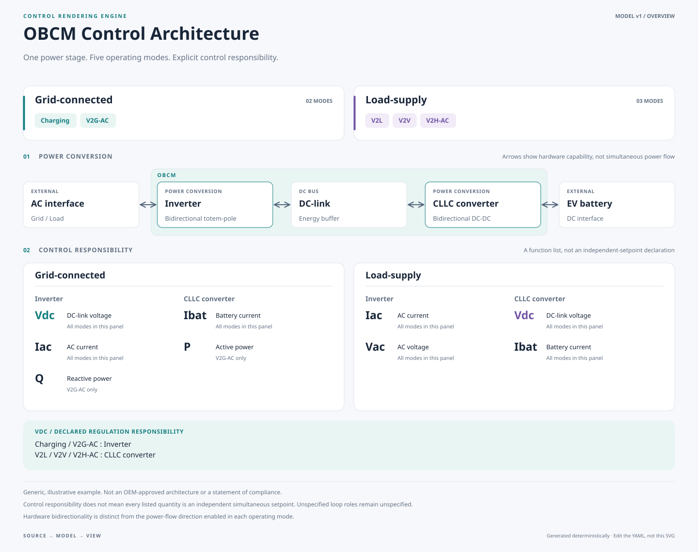

# Control Rendering Engine

**Describe the control architecture. Render the views. Review the change.**

YAML을 단일 원본으로 사용하는 로컬 우선 엔지니어링 다이어그램 도구입니다. AI는 의미 모델을 작성하고, TypeScript 렌더러는 정렬·간격·색·타이포그래피를 담당합니다. 좌표를 YAML에 섞지 않습니다.



## 바로 실행

Node.js **24 LTS 권장**, 지원 최소 버전은 22.16입니다. Windows PowerShell, macOS, Linux에서 같은 명령을 사용합니다.

```sh
git clone https://github.com/NaruForge/control-rendering-engine.git
cd control-rendering-engine
npm ci
npm run dev
```

브라우저에서 **http://127.0.0.1:5173**을 여세요. 설치 후 첫 화면은 예제 모델과 렌더링을 자동으로 표시합니다. Docker, Java, Python, 별도 데몬, API key는 필요하지 않습니다. 설치 시 npm 접속은 필요하지만 모델 해석과 렌더링은 로컬에서 수행합니다.

왼쪽에서 Architecture / Power topology / Control matrix / Mode detail / Signal graph를 선택하세요. Signal graph는 **Signal-loop study** 예제를 선택해야 표시됩니다. Studio, Midnight, Paper 테마를 전환하고 YAML을 편집하면 미리보기가 갱신됩니다. `YAML` 버튼은 편집기를 숨겨 다이어그램을 넓게 표시합니다.

브라우저 편집은 **메모리 내 변경**이며 Git 파일을 자동 수정하지 않습니다. `Save YAML`로 저장한 후 해당 파일을 저장소의 모델 파일에 반영하세요. 기밀 모델을 localStorage나 외부 서버에 자동 저장하지 않습니다.

## 파일에서 생성

```sh
npm run validate
npm run render
npm run render -- --input examples/obcm.yaml --view mode --mode v2g --theme midnight
npm run render -- --input examples/signal-loop.yaml --view signals --out artifacts/signals
npm run generate
```

`npm run render`는 기본적으로 `artifacts/`에 overview, topology, matrix, 각 모드의 SVG, Markdown 제어 매트릭스, CSV 검토 목록을 만듭니다. `npm run generate`는 Git에 관리하는 공개 예제 출력과 JSON Schema를 갱신합니다. 생성 파일이 아니라 `examples/*.yaml`과 `src/`를 수정하세요.

### PNG / PDF

SVG와 브라우저의 PNG 다운로드에는 별도 브라우저 설치가 필요하지 않습니다. CLI PNG/PDF export와 브라우저 자동 테스트에만 Playwright Chromium이 필요합니다.

```sh
npm run browser:install
npm run export -- artifacts/overview.svg artifacts/overview.png
npm run export -- artifacts/overview.svg artifacts/overview.pdf
```

CLI PDF는 SVG를 인쇄한 벡터 기반 단일 페이지입니다. 서버 환경에 이미 있는 Chromium은 `BROWSER_EXECUTABLE` 환경변수로 지정할 수 있습니다. 글꼴 파일은 포함하지 않습니다. 운영체제의 글꼴 차이로 글자 모양이 달라질 수 있으므로 외부 제출본은 같은 환경에서 생성하세요.

## 구현 범위

| 기능 | 구현 |
| --- | --- |
| 의미 모델 | YAML/JSON, Zod 검증, JSON Schema |
| 재사용 | 모드 상속, 단계별 제어 목록 명시적 대체 |
| 전용 프레젠테이션 | 모드 분류, 직렬 전력단, 제어 역할, 역할 매트릭스, 모드별 전력 흐름 |
| 일반 신호 그래프 | ELK layered / orthogonal routing / 고정 측면 포트 |
| 출력 | SVG, 브라우저 PNG, CLI PNG/PDF, Markdown, 검토 CSV |
| 검토 지원 | 단위 테스트, 브라우저 smoke, 결정적 SVG 비교, CI |
| AI 작성 | AGENTS.md, JSON Schema, 작성 규칙, 프롬프트 |

**v0.1의 범위를 명확히 제한합니다.** 전력 아키텍처 템플릿은 직렬 전력변환 경로용입니다. 임의의 분기 그래프는 별도 `signals` 뷰를 사용합니다. 무한 중첩 컨테이너, 수동 드래그 편집, 자동 제어 안정성 증명, 규격 인증, 양방향 Simulink 동기화는 구현하지 않았습니다. Paper는 흑백 프레젠테이션 테마이지 IEEE 출판 형식 인증이 아닙니다.

## 모델의 의미를 보존하는 규칙

예제의 충전 / V2G-AC / V2L / V2V / V2H-AC 다섯 모드와 제어 역할은 하나의 모델에서 파생됩니다. V2G에서만 P/Q 역할이 표시되며 V2H에 역방향 흡수나 계통 절연 상태를 임의로 추가하지 않습니다. 신호 루프 예제는 별도로 만든 **가정 기반 학습 예제**이며 실제 고객 제어 구현이 아닙니다.

`regulator`, `inner-loop`, `command`, `limit`, `unspecified`를 구분합니다. 기본값은 `unspecified`입니다. 전압·전류·전력을 나열했다고 해서 독립적인 동시 지령 또는 cascade 관계로 해석하지 않습니다. `exclusive: true`인 물리량의 중복 `regulator` 할당은 거부하지만, 이것이 에너지 수지·안정성·실시간 동작을 검증한다는 뜻은 아닙니다.

## 개발 / 검증

```sh
npm run typecheck
npm test
npm run build
npm run test:browser
```

`npm ci`는 lockfile을 사용합니다. CI는 Linux와 Windows에서 핵심 검증을 실행하고 브라우저 smoke는 Linux에서 실행하도록 구성합니다. 최초 baseline 생성 workflow는 lockfile·공개 예제 출력만 생성하며, 이후 일반 CI는 소스를 자동 수정하지 않습니다.

```text
examples/          의미 모델 원본
src/model.ts       스키마, 참조 검증, 상속 해석
src/render.ts      전용 프레젠테이션 템플릿
src/layout.ts      ELK 신호 그래프 geometry
src/svg.ts         안전한 SVG 요소 및 텍스트 레이아웃
src/theme.ts       디자인 토큰
src/engine.ts      브라우저 / Node 공통 API
src/app.ts         로컬 브라우저 workbench
src/cli.ts         파일 렌더링 CLI
src/report.ts      Markdown / CSV 파생 출력
schema/            생성된 JSON Schema
scripts/           이미지 export 및 브라우저 smoke
tests/             의미 검증 및 렌더러 테스트
docs/generated/    공개 예제의 검토용 생성본
```

개발 구조는 [architecture](docs/architecture.md), 모델 명세는 [model](docs/model.md), AI 작성은 [AI authoring](docs/ai-authoring.md)를 참조하세요.

## 공개 저장소 주의

예제는 일반화된 OBCM 모델입니다. OEM 승인·규격 적합성 또는 고객 요구사항 원문을 나타내지 않습니다. GM 사양 문서, CAN 신호 파일, 고객 기밀, 실제 제품의 미공개 파라미터는 포함하지 않습니다. `.private/`와 `*.local.yaml`은 Git에서 제외됩니다. `.gitignore`만으로 기밀 유출을 막을 수는 없으므로 `git diff --cached`를 확인하세요.

## License

이 저장소의 코드: MIT. 외부 패키지는 각자의 라이선스를 따릅니다. 특히 ELK/elkjs의 EPL-2.0 및 해당 패키지의 추가 라이선스 조건을 확인하세요. 브라우저 폰트는 시스템 폰트를 사용하며 외부 폰트를 배포하지 않습니다.
