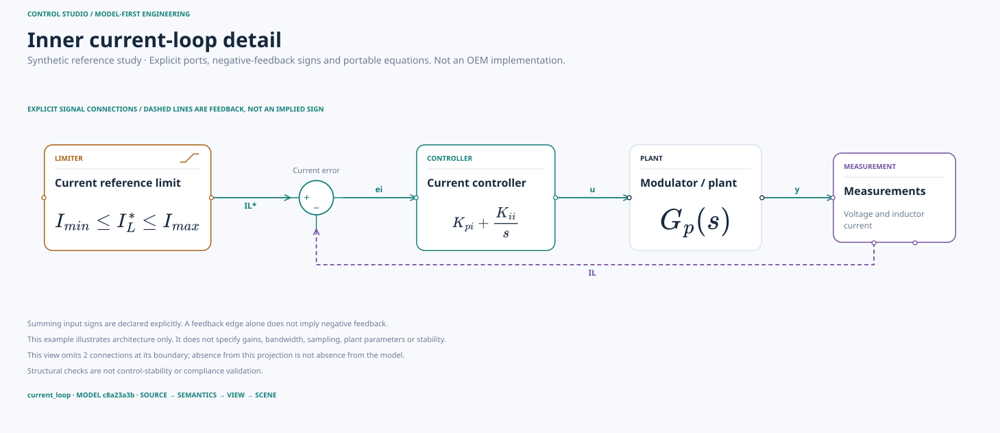

# Control Studio

**Model-first architecture and control-block diagrams.**

TypeScript 기반의 로컬 우선 다이어그램 서비스입니다. `.control` / YAML / JSON의 의미 모델을 검증하고, 여러 View와 동일한 Scene을 통해 **React Flow 화면과 독립 SVG 출력**을 생성합니다. 모델은 Git으로 관리하고, AI는 실제 MCP 도구로 조회·변경 제안·검증·렌더링합니다.



## 바로 실행

Node.js **24 권장**, 최소 **22.16**. Windows PowerShell, macOS, Linux에서 같은 명령입니다.

```sh
git clone https://github.com/NaruForge/control-rendering-engine.git
cd control-rendering-engine
npm ci
npm run dev
```

**http://127.0.0.1:5173**을 여세요. `npm start`는 브라우저도 엽니다. 별도 데이터베이스·API 키·Docker·Java·클라우드 렌더링 서비스는 필요하지 않습니다. 처음 의존성을 설치할 때는 npm 접속이 필요합니다.

기존 clone은 `git pull --ff-only` 후 `npm ci`로 갱신하세요. 저장소 이름은 유지하고 서비스 UI 이름은 **Control Studio**로 정리했습니다.

## 실제 구현 기능

| 영역 | 구현 |
| --- | --- |
| 의미 모델 | 엄격한 v2 스키마, 모드 상속, 제어 담당, 포트·수량 참조, 단일 입력 드라이버 검증 |
| 언어 | 실제 Langium `.control`, YAML/JSON 동등 입력, v1 YAML 호환 import, 소스 위치 진단 |
| View | Overview, 분기/계층형 Power, Control, Control matrix, include/focus/mode projection |
| 제어 블록 | 합산점과 명시적 +/−, gain, integrator, transfer, limiter, selector, plant, measurement, junction |
| 수식 | 제한된 TeX/AMS를 로컬 SVG glyph path로 변환; UI·출력에서 동일하게 사용 |
| 편집 | CodeMirror 소스, 모델 탐색·Inspector 의미 변경, 블록 추가, 선언 포트 연결, View 추가 |
| 검토 | Undo/Redo, stable-ID 의미 diff, 소스 진단, 구조적 레이아웃 audit |
| 화면 | React Flow fit/1:1/pan/zoom/minimap/selection, 세 가지 테마, 패널 접기 |
| 출력 | portable SVG, 브라우저 PNG, CLI PNG/PDF, scene JSON, Markdown/검토 CSV |
| AI | 실제 MCP stdio 서버와 8개 도구, schema resource, authoring prompt, agent skill |
| 언어 서비스 | stdio LSP: diagnostics/completion/symbols/definition/hover/formatting |

### 추천 확인 순서

**OBCM architecture**에서 Overview → Control matrix → Power를 비교하세요. **Cascaded control study**에서는 전체 루프 → Inner current-loop detail → Ownership-grouped view가 같은 모델을 다르게 표현합니다. **Branched power system**은 v1의 직렬 경로 제한을 없앤 예제이고, **Control symbol library**는 기호와 수식 표현을 보여 줍니다. 제어 루프와 분기 예제는 실제 고객 구현이 아닌 명시적 가정의 학습용 모델입니다.

`Source`는 코드 편집기를 열고, 블록/탐색기 선택은 Inspector를 엽니다. Inspector 변경은 MCP와 동일한 검증 연산을 사용합니다. `Connect`를 켜면 기존 출력 포트에서 입력 포트로 연결을 끌어 만든 뒤, 신호 ID와 signal/feedback 의미를 명시해 승인합니다. 전체 위치는 자동 배치합니다. **노드를 임의로 끌어 SVG 출력과 어긋나게 만드는 자유 배치는 제공하지 않습니다.**

**Fit**은 전체 구조 확인, **1:1**과 화면 이동은 상세 읽기용입니다. 작은 화면에 넓은 그래프를 모두 표시하면서 글자도 실제 크기로 유지할 수는 없습니다. Tablet 크기에서 사이드바·소스·Inspector를 독립적으로 접을 수 있습니다.

## 소스와 Git

브라우저 변경은 메모리에만 있습니다. **Save source로 내려받은 파일을 실제 저장소 원본에 반영**하세요. localStorage·원격 서버·Git 파일에 자동 저장하지 않습니다. 의미 변경 버튼은 소스를 정규화하므로 주석/서식은 보존하지 않으며, Undo로 이전 원문을 복원할 수 있습니다.

```sh
npm run validate -- --input examples/obcm.control
npm run render -- --input examples/cascade.control --view current_loop --out artifacts
npm run render -- --input examples/obcm.control --view power --mode v2g --theme midnight
npm run migrate -- --input examples/obcm.yaml --out artifacts/migrated.control
npm run diff -- --before examples/obcm.control --after my-model.control
npm run generate
```

`render`는 기본적으로 `artifacts/`에 SVG, scene JSON, 제어 매트릭스와 미검토 CSV를 생성합니다. `generate`는 Git에 관리하는 공개 예제 SVG와 스키마를 갱신합니다. 생성물을 손으로 수정하지 않습니다.

```text
examples/                     공학 모델 원본 및 v1 호환 fixture
src/domain/                   의미 스키마·검증·query·operation·diff
src/compiler/                 parse·migration·serialize·view·report
src/language/                 Langium 문법·생성 코드·LSP
src/layout/                   ELK 어댑터·계층 좌표 정규화·audit
src/scene/                    공유 도형·math·scene·SVG exporter
src/workbench/                React Flow·CodeMirror·worker·Inspector
src/agent/                    실제 MCP 서버
src/cli/                      로컬 파일 CLI
schema/                       생성 JSON Schema
.agents/skills/                AI authoring skill
```

## MCP / 언어 서버

```sh
npm run mcp:config
npm run mcp
npm run lsp
```

`mcp:config`는 현재 컴퓨터의 Node 및 launcher 절대 경로로 클라이언트 설정을 출력합니다. 이 launcher는 **다른 작업 디렉터리에서 호출되어도 동작**합니다. MCP는 `validate_model`, `list_views`, `inspect_element`, `trace_signal`, `get_control_owners`, `render_view`, `compare_models`, `propose_operations`를 제공합니다. **LLM 자체를 실행하지 않으며, 파일을 임의로 쓰거나 Git에 push하지 않습니다.**

자세한 모델 정의는 [model](docs/model.md), 문법·LSP는 [language](docs/language.md), AI 연동은 [AI authoring](docs/ai-authoring.md), 설계 판단은 [architecture](docs/architecture.md), 보안 경계는 [security](docs/security.md)를 참조하세요.

## 검증 / 이미지 출력

```sh
npm run check
npm run browser:install
npm run test:browser
npm run export -- artifacts/current_loop.svg artifacts/current_loop.png
npm run export -- artifacts/current_loop.svg artifacts/current_loop.pdf
```

CLI PNG/PDF 및 브라우저 자동 테스트에만 Playwright Chromium이 필요합니다. 이미 설치된 Chromium은 `BROWSER_EXECUTABLE`로 지정할 수 있습니다. 일반 브라우저 PNG/SVG 저장에는 추가 설치가 필요 없습니다. PDF는 단일 벡터 기반 페이지이며 글꼴은 실행 환경의 영향을 받습니다.

CI는 Windows/Ubuntu 및 최소 지원 Node에서 실제 설치·테스트·빌드·생성본 일치를 검사하고, Chromium에서는 **프로덕션 번들**의 UI·편집·진단·출력·태블릿 뷰포트를 테스트합니다. 실제 MCP/LSP stdio 클라이언트 통신도 테스트합니다. [검증 기록](docs/verification.md)을 함께 확인하세요.

## 명확한 범위

로컬 우선 서비스이지 다중 사용자 인증·실시간 공동 편집이 있는 hosted SaaS는 아닙니다. Langium은 단일 문서 언어 서비스까지 구현했고, multi-file import/rename 및 배포된 VS Code extension은 없습니다. 임의 그래프에서 완벽한 배치, 픽셀 단위 크로스플랫폼 폰트 일치, 제어 안정성·에너지 수지·규격 인증은 보장하지 않습니다. **source/model/layout 검증과 공학 검증은 다른 활동**입니다.

공개 저장소에는 일반화된 OBCM 모델과 합성 예제만 포함합니다. 고객 사양, CAN DB, 미공개 제품 정보는 `.private/` 등 승인된 별도 위치에 보관하고 public staging에 포함하지 마세요.

## License

저장소 자체 코드: MIT. React/React Flow/Langium 등 의존성은 각자의 라이선스를 따릅니다. elkjs는 EPL-2.0, MathJax는 Apache-2.0 등 해당 패키지의 NOTICE/라이선스 조건을 확인하세요. 외부 폰트 파일은 저장소에 포함하지 않습니다.
